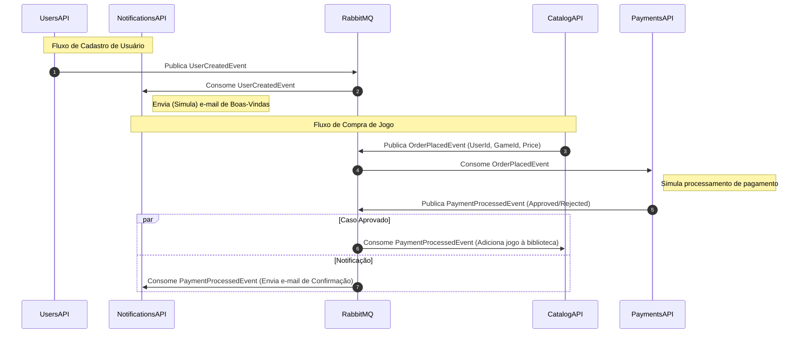

# 🏗️ FIAP Cloud Games (FCG) - Orquestração e Infraestrutura

Este repositório é o **ponto central de infraestrutura e orquestração** do ecossistema de microsserviços da FIAP Cloud Games (FCG), concebido como entrega para a **Fase 2** do **Tech Challenge (Pós-Tech FIAP)**.

Aqui residem as configurações de contêineres para execução local (Docker Compose) e as diretrizes para implantação em cluster de orquestração (Kubernetes).

---

## 🔗 Repositórios do Ecossistema

O sistema FCG foi decomposto de sua arquitetura monolítica original em **quatro microsserviços independentes** e autônomos, cada um residindo em seu próprio repositório Git:

*   👤 **Users API (Cadastro e Autenticação):** [fcg-usuario-api](https://github.com/alexoliveiraferreiradev/fcg-usuario-api)
*   🎮 **Catalog API (Catálogo de Jogos e Compras):** [fcg-catalog-api](https://github.com/alexoliveiraferreiradev/fcg-catalog-api)
*   💳 **Payments API (Processador de Pagamentos):** [fcg-payments-api](https://github.com/alexoliveiraferreiradev/fcg-payments-api)
*   ✉️ **Notifications API (Notificação por E-mail):** [fcg-notifications-api](https://github.com/alexoliveiraferreiradev/fcg-notifications-api)
*   🏗️ **Orquestração e Infraestrutura (Este Repositório):** [fcg-infrastructure](https://github.com/alexoliveiraferreiradev/fcg-infrastructure)

---

## 📐 Arquitetura e Fluxo Orientado a Eventos

A comunicação entre os serviços é realizada de forma assíncrona utilizando **RabbitMQ** como message broker para garantir resiliência e escalabilidade.



---

## 🛠️ Stack Tecnológica de Infraestrutura

*   **Banco de Dados:** SQL Server 2022 (para persistência de dados das APIs de Usuários e Catálogo).
*   **Mensageria:** RabbitMQ 3 (Broker de eventos assíncronos com interface de gerência habilitada).
*   **Orquestração Local:** Docker & Docker Compose.
*   **Orquestração de Produção:** Kubernetes (manifestos locais configurados).

---

## 🚀 Execução Local com Docker Compose

Este repositório disponibiliza as imagens necessárias dos serviços de infraestrutura (Banco de Dados e Mensageria) compartilhados pelas APIs para execução em ambiente de desenvolvimento.

### Pré-requisitos
*   [Docker Desktop](https://www.docker.com/products/docker-desktop/) ou Docker Engine instalado.

### Passo a Passo

1.  Clone este repositório:
    ```bash
    git clone https://github.com/alexoliveiraferreiradev/fcg-infrastructure.git
    cd fcg-infrastructure
    ```

2.  Crie o arquivo `.env` a partir do template `.env.example`:
    ```bash
    cp .env.example .env
    ```

3.  Configure uma senha segura de SA no arquivo `.env` para o SQL Server:
    ```env
    DB_SA_PASSWORD=SuaSenhaSegura123!
    ```

4.  Inicie os contêineres de infraestrutura básica:
    ```bash
    docker-compose up -d
    ```

5.  **Acesso aos painéis:**
    *   **RabbitMQ Management Console:** [http://localhost:15672](http://localhost:15672) (Login: `guest` | Senha: `guest`)
    *   **SQL Server Port:** `localhost:1433`

---

## ☸️ Implantação no Kubernetes

A arquitetura do Kubernetes foi desenhada para garantir isolamento físico e escalabilidade dos microsserviços. Conforme as diretrizes do desafio, os manifestos de cada microsserviço estão localizados em uma pasta `/k8s` na raiz de seus respectivos repositórios.

### Pré-requisitos
*   Cluster Kubernetes local em execução ([Kind](https://kind.sigs.k8s.io/), [Minikube](https://minikube.sigs.k8s.io/), ou Docker Desktop Kubernetes).
*   Ferramenta de linha de comando `kubectl` instalada.

### Configurações Necessárias
Os manifestos estão divididos em:
*   **Deployments:** Para gerenciar o ciclo de vida dos Pods de cada API.
*   **Services (ClusterIP):** Para comunicação interna entre os microsserviços utilizando nomes DNS locais (ex: `http://payments-api:80`).
*   **ConfigMaps:** Armazenamento de variáveis não sensíveis (nomes de filas, URLs).
*   **Secrets:** Armazenamento seguro de dados sensíveis (strings de conexão de bancos, senhas).

### Passo a Passo de Deploy

1.  **Implantar as dependências de infraestrutura compartilhada (Banco e RabbitMQ):**
    No repositório de infraestrutura, acesse a pasta com os manifestos de banco e fila e execute:
    ```bash
    kubectl apply -f k8s/db/
    kubectl apply -f k8s/rabbitmq/
    ```

2.  **Implantar os Microsserviços:**
    Entre na pasta raiz de cada um dos repositórios de microsserviço e aplique a pasta de manifestos `/k8s`:
    ```bash
    # Exemplo no repositório fcg-usuario-api
    cd ../fcg-usuario-api
    kubectl apply -f k8s/
    
    # Repita para catalog, payments e notifications
    ```

3.  **Verificar a Implantação:**
    Monitore a inicialização de todos os recursos no namespace padrão:
    ```bash
    kubectl get pods
    kubectl get services
    kubectl get configmaps
    kubectl get secrets
    ```

---

## 📄 Licença

Este projeto está licenciado sob a licença MIT - consulte o arquivo [LICENSE](file:///c:/Users/alx15/source/repos/fcg-infrastructure/LICENSE) para mais detalhes.
