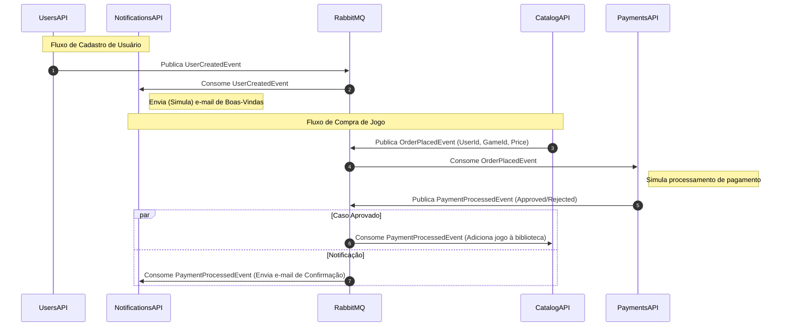

# 🏗️ FIAP Cloud Games (FCG) - Orquestração e Infraestrutura

Este repositório é o **ponto central de infraestrutura e orquestração** do ecossistema de microsserviços da FIAP Cloud Games (FCG), concebido como entrega para a **Fase 2** do **Tech Challenge (Pós-Tech FIAP)**.

Aqui residem as configurações de contêineres para execução local (Docker Compose) e as diretrizes para implantação em cluster de orquestração (Kubernetes).

---

## 🔗 Repositórios do Ecossistema

O sistema FCG foi decomposto de sua arquitetura monolítica original em **quatro microsserviços independentes** e autônomos, cada um residindo em seu próprio repositório Git:

*   👤 **Users API (Cadastro e Autenticação):** [fcg-usuario-api](https://github.com/alexoliveiraferreiradev/fcg-usuario-api)
*   🎮 **Catalog API (Catálogo de Jogos e Compras):** [fcg-catalog-api](https://github.com/alexoliveiraferreiradev/fcg-catalog-api)
*   💳 **Payments API (Processador de Pagamentos):** [fcg-payments-api](https://github.com/alexoliveiraferreiradev/fcg-payments-api)
*   ✉️ **Notifications API (Notificação por E-mail):** [fcg-notifications-api](https://github.com/alexoliveiraferreiradev/fcg-notifications-api)
*   🏗️ **Orquestração e Infraestrutura (Este Repositório):** [fcg-infrastructure](https://github.com/alexoliveiraferreiradev/fcg-infrastructure)

---

## 📐 Arquitetura e Fluxo Orientado a Eventos

A comunicação entre os serviços é realizada de forma assíncrona utilizando **RabbitMQ** como message broker para garantir resiliência e escalabilidade.



---

## 🛠️ Stack Tecnológica de Infraestrutura

*   **Banco de Dados:** SQL Server 2022 (para persistência de dados das APIs de Usuários e Catálogo).
*   **Mensageria:** RabbitMQ 3 (Broker de eventos assíncronos com interface de gerência habilitada).
*   **Orquestração Local:** Docker & Docker Compose.
*   **Orquestração de Produção:** Kubernetes (manifestos locais configurados).

---

## 🚀 Guia de Execução Local com Docker Compose

O arquivo `docker-compose.yml` deste repositório de orquestração está configurado para inicializar **todo o ecossistema FCG** (banco de dados, mensageria, cache, microsserviços e migrações automáticas de banco de dados).

### Pré-requisitos
*   [Docker Desktop](https://www.docker.com/products/docker-desktop/) ou Docker Engine com Docker Compose instalado.

### Passo a Passo para Execução

1.  **Clone o Repositório de Orquestração (se ainda não o fez):**
    ```bash
    git clone https://github.com/alexoliveiraferreiradev/fcg-infrastructure.git
    cd fcg-infrastructure
    ```

2.  **Preparação das Variáveis de Ambiente (`.env`):**
    A aplicação utiliza variáveis de ambiente para credenciais do SQL Server, chaves de autenticação JWT e Redis. Copie o modelo `.env.example` para `.env`:
    *   **No Linux/macOS (Terminal):**
        ```bash
        cp .env.example .env
        ```
    *   **No Windows (PowerShell):**
        ```powershell
        Copy-Item .env.example .env
        ```
    *   **No Windows (Prompt de Comando - CMD):**
        ```cmd
        copy .env.example .env
        ```
    *   **Manualmente:** Copie o arquivo `.env.example` no Explorador de Arquivos, cole-o na mesma pasta e renomeie a cópia para `.env`.

    > [!NOTE]
    > O arquivo `.env` padrão já vem preenchido com senhas e segredos funcionais para testes locais.

3.  **Iniciar toda a Aplicação:**
    Execute o comando abaixo para construir as imagens necessárias e subir todos os contêineres em segundo plano:
    ```bash
    docker compose up -d 
    ```
  

4.  **Verificar se os Contêineres Estão Saudáveis:**
    Aguarde cerca de 30 a 45 segundos para que as migrações de banco de dados (`fcg-users-db-migration`, `fcg-payments-db-migration`, `fcg-catalog-db-migration`) terminem de rodar e os microsserviços se iniciem. Para verificar o status:
    ```bash
    docker compose ps
    ```
    Todos os serviços principais devem estar listados como `running` (ou `healthy` para o banco de dados).

### 🖥️ Mapeamento de Portas e Serviços Locais (Docker)

Uma vez inicializada a aplicação via Docker Compose, você poderá acessar os microsserviços e painéis nas seguintes portas locais:

| Componente | Tipo de Serviço | URL de Acesso | Descrição |
| :--- | :--- | :--- | :--- |
| **Users API** | Microsserviço | [http://localhost:8081/swagger](http://localhost:8081/swagger) | Swagger de Usuários e Autenticação |
| **Catalog API** | Microsserviço | [http://localhost:8084/swagger](http://localhost:8084/swagger) | Swagger de Catálogo de Jogos e Compras |
| **Payments API** | Microsserviço | Não possui visualização | Simulador de Processamento de Pagamento |
| **Notifications API**| Microsserviço | Não possui visualização | Consumidor e logger de e-mails / notificações |
| **RabbitMQ Admin** | Painel Web | [http://localhost:15672](http://localhost:15672) | Console (Login: `guest` \| Senha: `guest`) |
| **RedisInsight** | Painel Web | [http://localhost:8001](http://localhost:8001) | Interface Web de visualização de Cache do Redis |
| **SQL Server 2022** | Banco de Dados | `localhost:1433` | Host do banco (User: `sa` \| Senha: do `.env`) |

---

## ☸️ Guia de Implantação no Kubernetes (k8s)

Os manifestos de orquestração do cluster Kubernetes local foram construídos de forma modular. A infraestrutura compartilhada (Banco de Dados, Redis, RabbitMQ) reside neste repositório `fcg-infrastructure`, enquanto os manifestos específicos de cada microsserviço encontram-se dentro de seus respectivos repositórios sob a pasta `/k8s`.

### Pré-requisitos
*   Um cluster Kubernetes local rodando ([Docker Desktop Kubernetes](https://docs.docker.com/desktop/kubernetes/), [Minikube](https://minikube.sigs.k8s.io/), [Kind](https://kind.sigs.k8s.io/) ou [k3d](https://k3d.io/)).
*   Ferramenta de CLI `kubectl` devidamente configurada.

---

### Passo 1: Implantar a Infraestrutura Compartilhada
A partir da raiz do repositório `fcg-infrastructure`, aplique todos os manifestos de infraestrutura localizados na pasta `k8s`. Eles configurarão os Deployments, Services (ClusterIP), ConfigMaps, Secrets e volumes (PVCs) para o SQL Server, Redis e RabbitMQ:

```bash
kubectl apply -f k8s/
```

Você pode verificar se a infraestrutura subiu corretamente com:
```bash
kubectl get pods
```
Aguarde até que os pods do SQL Server, Redis e RabbitMQ estejam no status `Running`.

---

### Passo 2: Implantar os Microsserviços do Ecossistema
Navegue até a pasta de cada um dos microsserviços clonados em sua máquina e aplique os manifestos Kubernetes de cada um deles utilizando o comando `kubectl apply -f k8s/`.

Assumindo que os repositórios estão no mesmo diretório pai:

```bash
# 1. Implantar Microsserviço de Usuários (Users API)
cd ../fcg-usuario-api
kubectl apply -f k8s/

# 2. Implantar Microsserviço de Catálogo (Catalog API)
cd ../fcg-catalog-api
kubectl apply -f k8s/

# 3. Implantar Microsserviço de Pagamentos (Payments API)
cd ../fcg-payments-api
kubectl apply -f k8s/

# 4. Implantar Microsserviço de Notificações (Notifications API)
cd ../fcg-notifications-api
kubectl apply -f k8s/
```

---

### Passo 3: Monitorar e Validar a Implantação
Monitore a criação dos pods até que todos os microsserviços estejam em execução estável (`Running`):

```bash
# Acompanhar a inicialização dos pods em tempo real
kubectl get pods -w
```

Você também pode inspecionar os recursos gerados com os seguintes comandos:
```bash
kubectl get deployments
kubectl get services
kubectl get configmaps
kubectl get secrets
```

---

### Passo 4: Acessar a Aplicação no Cluster Local

Em caso de serviços cluster onde é **ClusterIP** e tem página de visualização, como o RedisInsight e o RabbitMq, será necessário realizar 
o port-forward da porta desejada:


> ```bash
> kubectl port-forward svc/rabbitmq-service 15672:15672
> kubectl port-forward svc/redis-service 8001:5540
> ```

---

## 📄 Licença

Este projeto está licenciado sob a licença MIT - consulte o arquivo [LICENSE](LICENSE) para mais detalhes.
